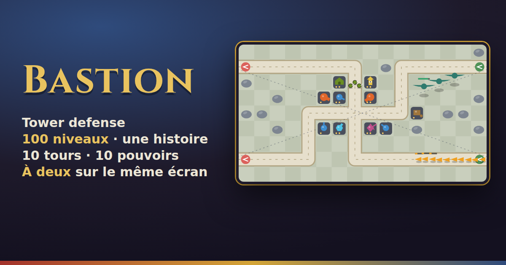

# Bastion

Bastion est un jeu de **tower defense** qui se joue dans le navigateur, sur ordinateur, tablette et téléphone.

Le duc Mordrac marche sur le royaume. Ses armées suivent des routes. Vous placez des tours le long de ces routes pour les arrêter avant qu'elles n'arrivent au bout.

Le jeu se passe dans le même royaume que [Catapulte Mania](https://github.com/adamrodwebdev/catapulte-mania), avec les mêmes personnages.



## Ce que contient le jeu

- **Une campagne de 100 niveaux**, en 10 chapitres : la Frontière, les Marais, le Désert, la Montagne, l'Hiver, la Forêt noire, l'Orage, les Terres brûlées, les Remparts et la Capitale. Chaque chapitre finit par un boss.
- **Une histoire** racontée par quatre personnages : la reine Ysolde, le vieux roi Aubert, Maître Gontran et le duc Mordrac. On peut relire tous les épisodes dans **la Chronique**.
- **10 tours** : Archers, Caserne (des soldats bloquent la route), Bombarde, Tour de givre, Baliste, Tour de guet, Trésorerie, Catapulte, Brasero et Tour d'orage. Chaque tour a 3 niveaux, puis une **version d'élite** à débloquer.
- **18 ennemis** : des volants, des invisibles, des blindés, des soigneurs, des béliers, des tours de siège… et des boss.
- **10 pouvoirs spéciaux** (Pluie de flèches, Gel, Renforts, Météores…). Chaque pouvoir doit se recharger après usage : un chronomètre indique quand il est de nouveau prêt.
- **300 succès** : chaque niveau propose 3 défis (par exemple « ne perdre aucune vie » ou « gagner sans construire de caserne »).
- **L'Atelier** : les victoires et les défis rapportent des **couronnes**. On les dépense pour des améliorations qui restent d'une partie à l'autre (plus de vies, plus d'or, des tours moins chères, un emplacement de pouvoir en plus…).
- **À deux sur le même écran** :
  - **Coopération** : une campagne de 100 niveaux à deux. Chaque joueur a son or et ses tours.
  - **Duel** : l'écran est coupé en deux. Chacun défend son côté et envoie des ennemis chez l'autre.
- **3 difficultés** : Facile, Normal, Difficile.
- **Une aide pas à pas** dans les premiers niveaux, puis à chaque nouvelle tour et chaque nouveau pouvoir.
- **Sauvegarde automatique** dans le navigateur. On peut quitter au milieu d'un niveau et reprendre plus tard.
- **Musique et bruitages** créés directement par le navigateur (aucun fichier son à télécharger).
- **Français et anglais**, **mode sombre**, et commandes au clavier.

## Lancer le projet

Il faut avoir [Node.js](https://nodejs.org) installé (version 18 ou plus).

```bash
npm install        # installe les dépendances (une seule fois)
npm run dev        # lance le jeu en local, l'adresse s'affiche dans le terminal
```

Autres commandes utiles :

| Commande | À quoi elle sert |
|---|---|
| `npm run build` | Crée la version finale du site dans le dossier `dist/`. |
| `npm run preview` | Affiche la version finale en local, pour la vérifier avant de la mettre en ligne. |
| `npm test` | Un robot joue les 100 niveaux pour vérifier qu'ils sont tous gagnables. |
| `npm run check:i18n` | Vérifie qu'aucun texte ne manque en français ou en anglais. |
| `npm run build:crazygames` | Crée la version pour le site CrazyGames (avec ses publicités) dans `dist-crazygames/`. |
| `npm run build:poki` | Crée la version pour le site Poki (avec ses publicités) dans `dist-poki/`. |

Le robot de `npm test` accepte quelques options, par exemple :

```bash
node scripts/simulate.mjs --diff hard          # tous les niveaux en Difficile
node scripts/simulate.mjs --from 40 --to 60    # seulement les niveaux 40 à 60
```

## Mettre le site en ligne

Le jeu est en ligne sur **https://bastion-tower-defense.netlify.app**.

Netlify est relié au dépôt GitHub : chaque fois qu'on pousse sur la branche `main`, le site est reconstruit et mis à jour tout seul, en une à deux minutes. Pour une pull request, Netlify crée aussi un **aperçu** avec sa propre adresse, pour tester avant de fusionner. La configuration est dans le fichier `netlify.toml`.

Si l'adresse du site change un jour, mettez-la aussi à jour dans `index.html`, `public/robots.txt` et `public/sitemap.xml`. Cela aide Google à bien référencer le jeu.

## Publier sur CrazyGames ou Poki

Ces sites accueillent des jeux web et les rémunèrent avec de la publicité.

1. Lancez `npm run build:crazygames` (ou `npm run build:poki`).
2. Compressez le **contenu** du dossier `dist-crazygames/` (ou `dist-poki/`) en un fichier `.zip`.
3. Envoyez ce fichier depuis l'espace développeur du site.
4. Ajoutez les images de présentation du dossier `marketing/` (formats 1920×1080, 800×1200 et 800×800).

Ces versions affichent une publicité entre deux niveaux (pas trop souvent) et proposent des publicités **facultatives** : revivre après une défaite, ou doubler les couronnes gagnées. Notre propre site, lui, n'a aucune publicité.

## Comment le code est organisé

Le code est séparé en trois parties :

- **`src/core/`** : le moteur du jeu (les règles, les tours, les ennemis, les vagues, l'histoire, les succès…). Il ne dépend pas de Vue, ce qui permet de le tester tout seul.
- **`src/services/`** : les outils partagés (sauvegarde, traduction, thème clair ou sombre, sons, publicités).
- **`src/components/`** : l'interface, faite avec Vue.

Chaque fichier commence par un commentaire qui explique son rôle. Les détails techniques sont dans les commentaires du code.

### Où trouver quoi

| Je veux changer… | Fichier |
|---|---|
| Les chapitres (décor, routes, rochers) | `src/core/config/chapters.js` |
| La difficulté des niveaux (vie des ennemis, or de départ) | `src/core/config/Level.js` |
| Le contenu des vagues | `src/core/config/WaveGenerator.js` |
| À quel niveau une tour, un pouvoir ou un ennemi apparaît | `src/core/config/unlocks.js` |
| Une tour | `src/core/entities/towers/types.js` |
| Un ennemi | `src/core/entities/enemies/types.js` |
| Un pouvoir | `src/core/powers/powers.js` |
| Les défis des niveaux | `src/core/progression/Achievements.js` |
| Les améliorations de l'Atelier | `src/core/progression/UpgradeCatalog.js` |
| Le nombre de couronnes gagnées | `src/core/progression/GoldRules.js` |
| Les textes et l'histoire | `src/locales/fr.js` et `src/locales/en.js` |
| Le mode Duel | `src/core/modes/DuelMatch.js` |
| Les couleurs et la mise en page | `src/styles/main.css` |

Après un changement d'équilibrage, lancez `npm test` pour voir si les niveaux restent gagnables. Après un changement de texte, lancez `npm run check:i18n`.

### Ajouter une langue

1. Copiez `src/locales/en.js` et renommez la copie (par exemple `de.js` pour l'allemand).
2. Traduisez les textes, sans changer les noms des clés.
3. Ajoutez la langue dans `src/services/index.js` et dans `scripts/check-i18n.mjs`.

## Jouer au clavier

### Seul

Cliquez d'abord sur le plateau de jeu, puis :

| Touche | Action |
|---|---|
| Flèches | Déplacer la sélection |
| `1` à `0` | Construire une tour |
| `Entrée` | Sélectionner la case |
| `U` | Améliorer la tour |
| `S` | Vendre la tour |
| `Q`, `W`, `E`, `R`, `T` | Pouvoirs |
| `Espace` | Lancer la vague |
| `P` ou `Échap` | Pause |

### Coopération

Le joueur 1 joue à la souris ou au doigt. Le joueur 2 joue au clavier :

| Touche | Action |
|---|---|
| Flèches | Déplacer son curseur |
| `1` à `0` | Construire une tour |
| `U` | Améliorer sa tour |
| `Retour arrière` | Vendre sa tour |
| `Q` à `T` | Pouvoirs |

### Duel

| | Joueur 1 | Joueur 2 |
|---|---|---|
| Bouger | `W` `A` `S` `D` | Flèches |
| Construire | `1` à `5` | `6` à `0` |
| Améliorer | `R` | `L` |
| Vendre | `F` | `K` |
| Envoyer des ennemis | `Z` `X` `C` | `B` `N` `M` (ou pavé numérique) |

Sur tablette, chaque joueur peut aussi toucher directement sa moitié d'écran.

## Travailler à plusieurs

Avant de modifier le code, lisez [CONTRIBUTING.md](CONTRIBUTING.md). Il explique comment nommer les branches et écrire les messages de commit.

Les changements de chaque version sont listés dans [CHANGELOG.md](CHANGELOG.md).

## Crédits

- Police de titres : [Cinzel](https://fonts.google.com/specimen/Cinzel), sous licence SIL Open Font License (voir `src/assets/fonts/OFL-Cinzel.txt`).
- Portraits des personnages : repris de Catapulte Mania.
